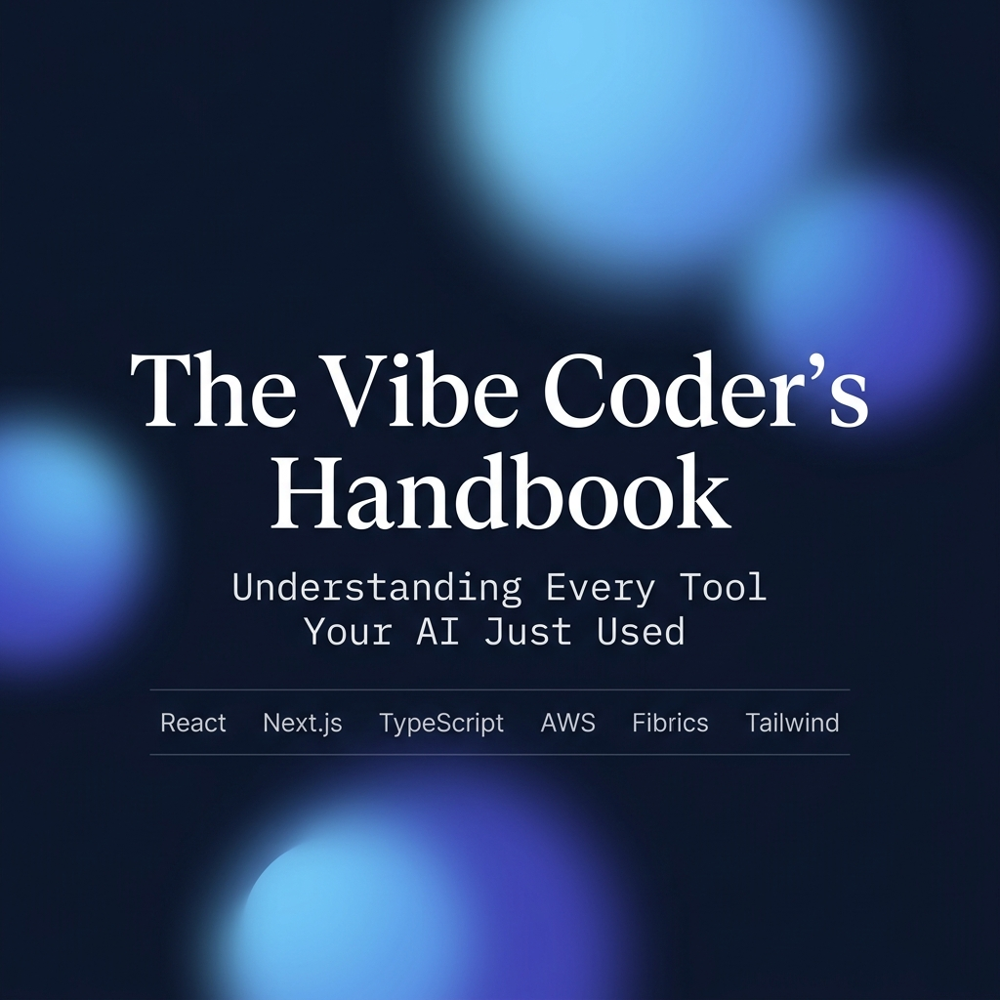

# 📘 The Vibe Coder's Handbook



> **The No-BS Guide to Understanding the Modern JavaScript Ecosystem**

**React • Next.js • TypeScript • Node.js • Tailwind • Express • Drizzle • Zustand • Zod**

For vibe coders, returning developers, and curious minds who want to understand the code their AI just generated.

---

## 🌟 The Mission

If you've ever used Cursor, Bolt, Replit, or Claude to build an app, you've probably seen a mountain of code filled with words like "Hooks," "Server Components," "Hydration," and "ORMs." 

**This book fixes that.** It isn't a tutorial on how to code—there are thousands of those. Instead, this is a **map**. It explains what every major tool in the 2026 JavaScript ecosystem does, why it exists, and which ones you actually need.

This guide is maintained as a community-driven project dedicated to clarifying the JS ecosystem for AI-era developers.

## 📖 Read Online

Visit **[vibecodershandbook.pages.dev](https://vibecodershandbook.pages.dev)** (Community Edition) to experience:

- 🔍 **Full-Text Search**: Powered by Pagefind (press `Ctrl+K`).
- 📱 **Mobile-First Design**: Read on any device.
- 🗺️ **Active Navigation**: Interactive sidebar and per-chapter TOC.
- 📄 **Offline PDF**: [Download the latest PDF version](https://vibecodershandbook.pages.dev/TheVibeCodersHandbook.pdf) generated at build-time.

---

## 🛠️ Built with Astro 5

This site is a high-performance documentation engine built using the latest web technologies:

- **Framework**: [Astro 5.x](https://astro.build) (Content Layer API)
- **Styling**: Tailwind CSS + Custom Serif Typography (Instrument Serif & Source Serif 4)
- **Search**: Static search indexing via [Pagefind](https://pagefind.app)
- **PDF Generation**: Automated PDF builds using [astro-pdf](https://github.com/nicmatthews/astro-pdf)
- **Deployment**: Optimized for [Cloudflare Pages](https://pages.cloudflare.com/)

---

## 🤝 Community-Driven

We believe knowledge should be free and easy to understand. This project is open for contributions!

- **Found a typo?** Edit the Markdown.
- **Explanation too complex?** Simplify it with an analogy.
- **New tool on the block?** Add a chapter.

See our **[CONTRIBUTING.md](./CONTRIBUTING.md)** for the simple, no-setup guide to contributing.

---

## 🚀 Local Development

If you want to run the handbook locally or contribute to the site's engine:

```bash
# Prerequisites: Node.js 22+
node -v 

# 1. Install dependencies
npm install

# 2. Start dev server
npm run dev

# 3. Type-check the Astro project
npm run check

# 4. Build the full release artifact (site + PDF + search index)
npm run build

# 5. Optional: build just the site shell for a faster smoke test
npm run build:site
```

`npm run build` is the deploy-equivalent build. It generates the static site, the `Pagefind` search index, and `TheVibeCodersHandbook.pdf`.

## 🚢 Deployment

- Pull requests run CI for type-checking and a full artifact build.
- Pushes to `main` deploy to Cloudflare Pages from GitHub Actions.
- The deploy job also sets `GITHUB_TOKEN` so contributor fetching is less likely to hit the unauthenticated GitHub API rate limit.

## 📄 License & Credits

- **Original Author**: [Nasser AlNasser](https://github.com/nasserDev)
- **Community Maintainer**: [h4harsimran](https://github.com/h4harsimran)
- **License**: This guide is free to share and distribute. Knowledge should have no paywall.

*“Knowledge should be free. Confusion should be temporary.”*
